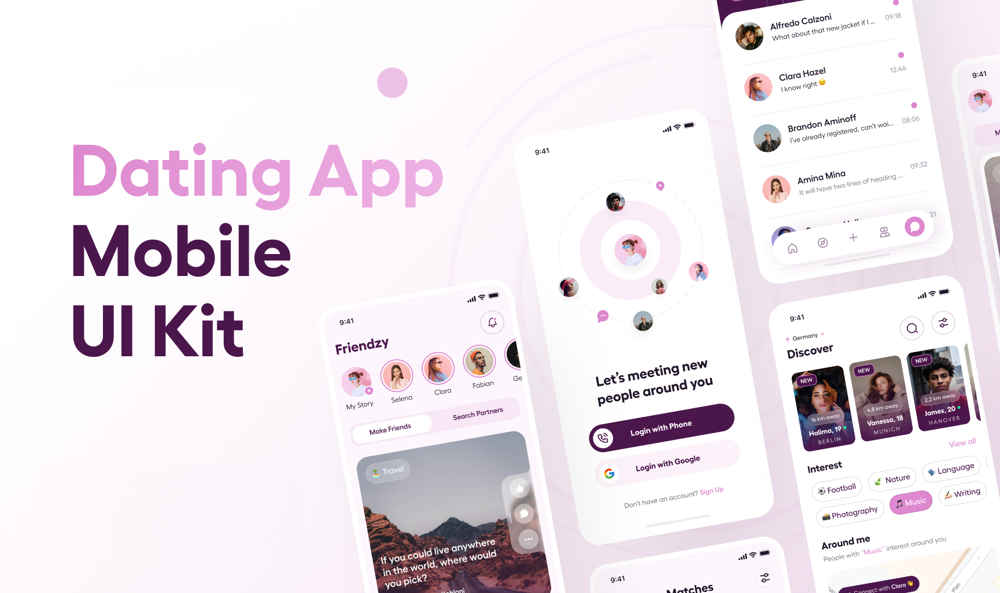
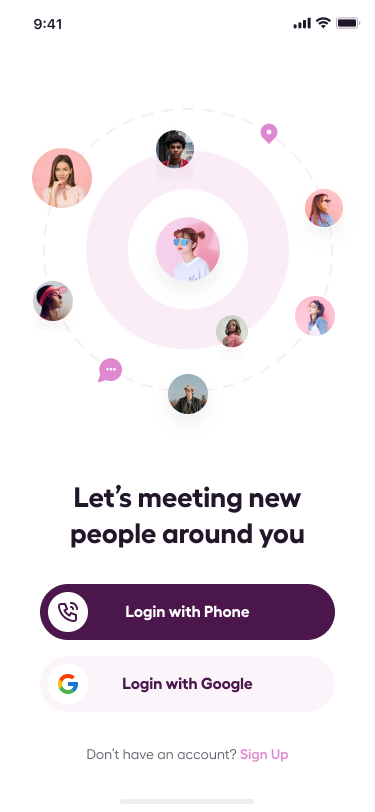
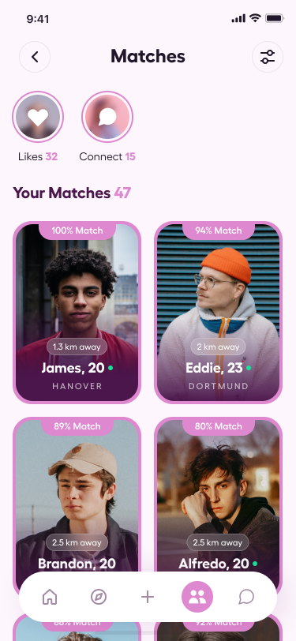
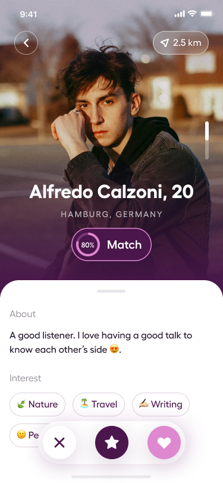

<h1 align="center">fanfic match app</h1>

  <a href="#-tecnologias">Tecnologias</a>&nbsp;&nbsp;&nbsp;|&nbsp;&nbsp;&nbsp;
  <a href="#-projeto">Projeto</a>&nbsp;&nbsp;&nbsp;|&nbsp;&nbsp;&nbsp;
  <a href="#-como-executar">Como executar</a>&nbsp;&nbsp;&nbsp;|&nbsp;&nbsp;&nbsp;
  <a href="#-saiba-mais">Saiba mais</a>&nbsp;&nbsp;&nbsp;|&nbsp;&nbsp;&nbsp;
  <a href="#-licença">Licença</a>

  

 

## ✨ Tecnologias

Esse projeto foi desenvolvido com as seguintes tecnologias:

- [Expo](https://docs.expo.dev/)
- [React Native](https://reactnative.dev/)

## 💻 Projeto

Um app de relacionamento no foco com animes & games

## 🚀 Como executar

Para iniciar o seu projeto.

- Instale as dependências com `npm install ou yarn add`
- Inicie o projeto com `npm run start`

## ⚡️ Saiba mais

- Figma: [https://www.figma.com/file/sPpmUembF6MMrij5A1TrgT/[FREE]-Friendzy---Dating-Mobile-App-UI-Kit-(Community)?type=design&node-id=0-1&mode=design&t=21GngRnfiSgRasUM-0](<https://www.figma.com/file/sPpmUembF6MMrij5A1TrgT/[FREE]-Friendzy---Dating-Mobile-App-UI-Kit-(Community)?type=design&node-id=0-1&mode=design&t=21GngRnfiSgRasUM-0/>)

## 📄 Licença

Esse projeto está sob a licença MIT. Veja o arquivo [LICENSE](LICENSE.md) para mais detalhes.

---

Feito com ♥ by Pedro;
